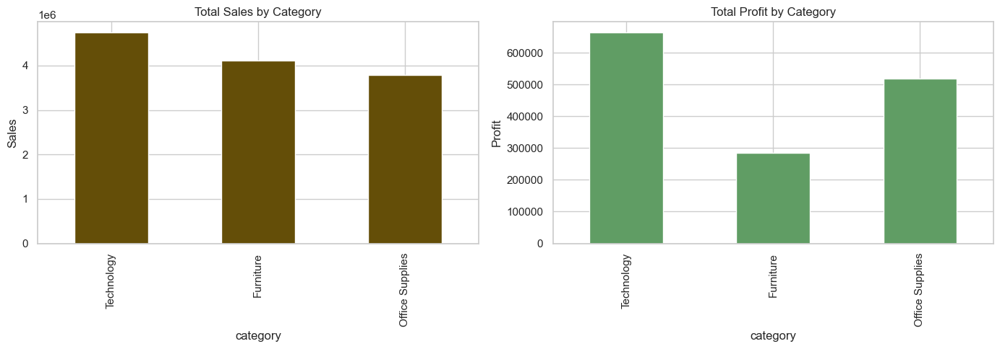
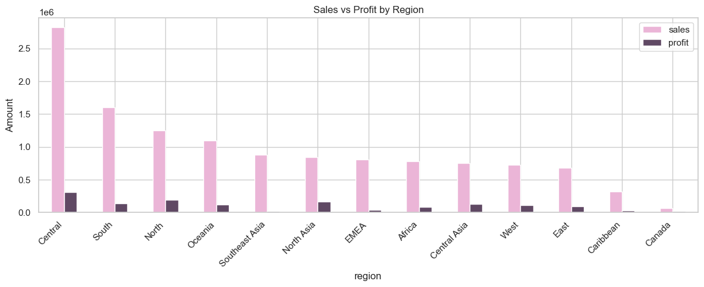
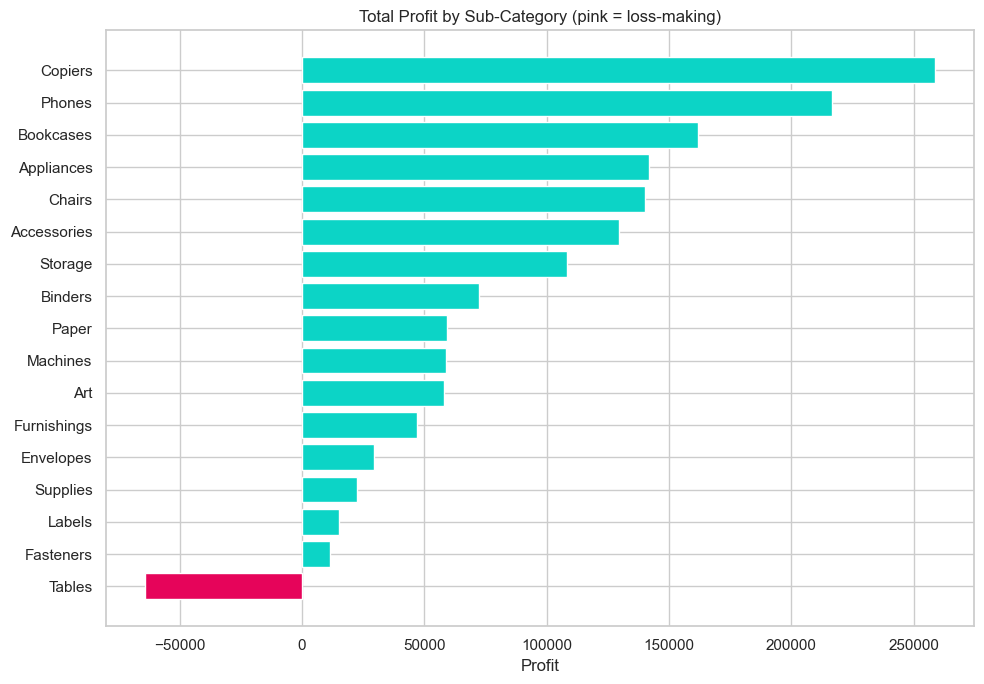
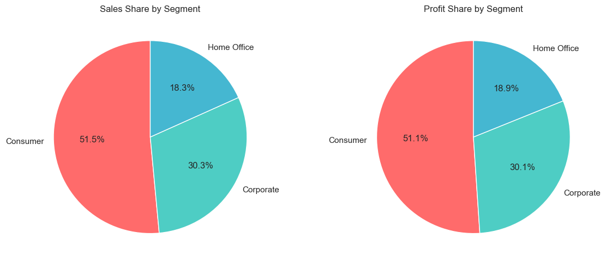
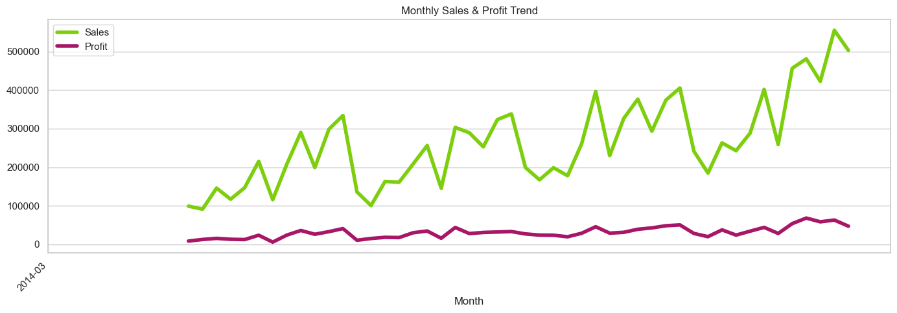
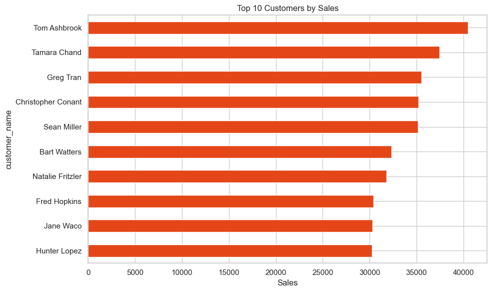
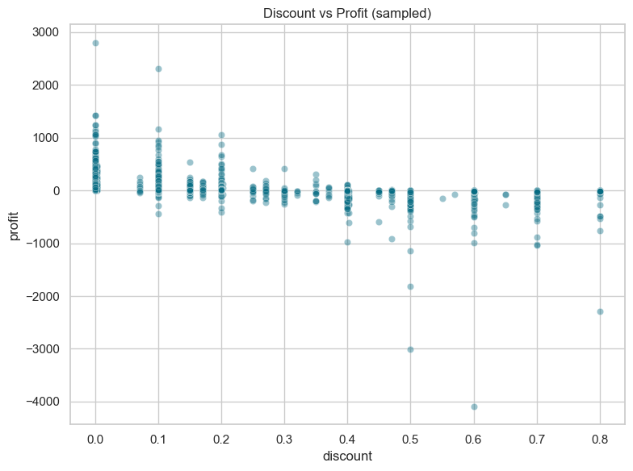
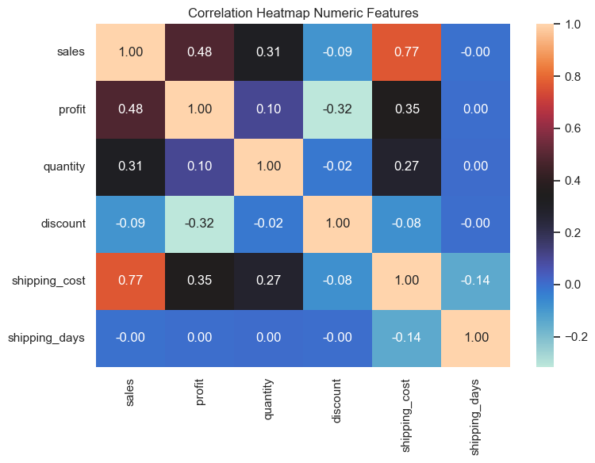
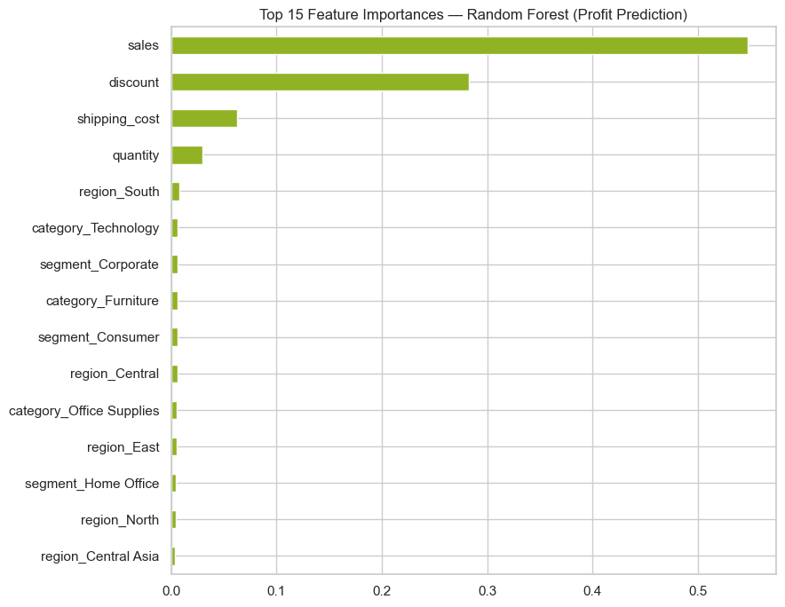
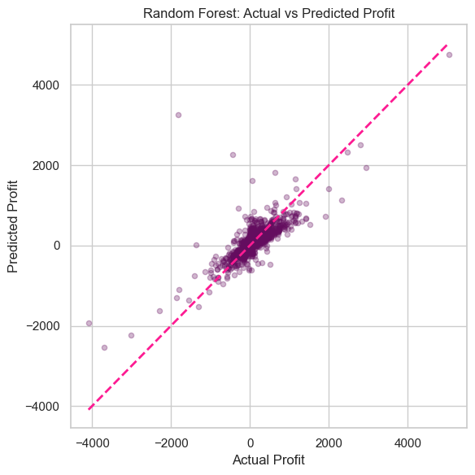

# 📊 Interactive Business Dashboard in Streamlit for Global Superstore

An end-to-end Business Intelligence project analyzing sales, profit, and segment-wise performance for the Global Superstore dataset, combining exploratory data analysis, a profit-prediction model, and a fully interactive Streamlit dashboard.

---

## 🎯 1. Objective

Global Superstore operates across multiple markets (US, EU, LATAM, Africa, APAC, EMEA, Canada) and needs a clear, data-driven view of performance by region, product categories, and customer segments. This project aims to:

- Clean and prepare the Global Superstore dataset for analysis
- Perform Exploratory Data Analysis (EDA) to uncover sales and profit patterns
- Build a lightweight regression model to predict order-level **Profit** and identify its key drivers
- Deliver an **interactive Streamlit dashboard** with Region / Category / Sub-Category filters and live KPI visualizations (Total Sales, Profit, Top 5 Customers by Sales)

---

## 📁 2. Project Structure

```
Interactive-Business-Dashboard-in-Streamlit-for-Global-Superstore/
└── Global_Superstore/
    ├── superstore.csv                    # Raw dataset
    ├── superstore_cleaned.csv            # Cleaned dataset (output of the notebook)
    ├── Superstore_BI_Analysis.ipynb      # Full EDA + modeling notebook
    ├── streamlit_dashboard.py            # Interactive BI dashboard
    ├── README.md                         # Project documentation
    └── images/                           # Exported visualizations
        ├── plot1_total_sales_profit.png
        ├── plot2_sales_profit_region.png
        ├── plot3_profit_sub-category.png
        ├── plot4_sales_profit_segment.png
        ├── plot5_monthly_sales_trend.png
        ├── plot6_top_10_customers_sales.png
        ├── plot7_discount_vs_profit.png
        ├── plot8_correlation.png
        ├── plot9_feature_importances.png
        └── plot10_randomforest.png
```

## 📁 3. Dataset Overview

**Source:** Global Superstore Dataset (`superstore.csv`)
**Size:** 51,290 order-level records × 27 columns

| Column | Description |
|---|---|
| `Order.Date`, `Ship.Date` | Order and shipping dates |
| `Category`, `Sub.Category` | Product hierarchy (Furniture, Office Supplies, Technology) |
| `Region`, `Market`, `Country`, `State`, `City` | Geographic hierarchy |
| `Segment` | Customer segment (Consumer, Corporate, Home Office) |
| `Sales`, `Profit`, `Quantity`, `Discount`, `Shipping.Cost` | Order financials |
| `Customer.ID`, `Customer.Name` | Customer identifiers |
| `Ship.Mode`, `Order.Priority` | Fulfillment attributes |

After cleaning: **51,289 valid records**, no missing values, 0 duplicate rows.

---

## ⚙️ 4. Technical Approach

1. **Data Cleaning:** standardized column names to snake_case, parsed date fields, removed 1 invalid row (non-positive sales), dropped irrelevant helper columns, engineered `order_month`, `order_year`, and `shipping_days`.
2. **EDA:** aggregated sales/profit by Category, Region, Sub-Category, and Segment; analyzed monthly trends, top customers, and the relationship between discount and profit.
3. **Modeling:** trained Linear Regression and Random Forest models to predict order-level **Profit** from `Sales`, `Quantity`, `Discount`, `Shipping Cost`, `Category`, `Segment`, and `Region` (one-hot encoded), evaluated with R², MAE, and RMSE.
4. **Dashboard:** built an interactive Streamlit app using Plotly, with sidebar filters for Region, Category, Sub-Category, and Year, and live-updating KPI cards and charts.

**Tools & Libraries:** Pandas, NumPy, Scikit-learn, Matplotlib, Seaborn, Streamlit, Plotly

---

## 🤖 5. Model Performance

Predicting order-level **Profit**:

| Model | R² | MAE | RMSE |
|---|---|---|---|
| Linear Regression | 0.163 | 60.22 | 158.32 |
| **Random Forest** | **0.636** | **34.99** | **104.42** |

The Random Forest model substantially outperforms Linear Regression, capturing non-linear relationships between discount, sales volume, and profit. Feature importance analysis (see `plot9_feature_importances.png`) confirms **Discount** and **Sales** as the dominant predictors of profitability.

---

## 📈 6. Visualizations & Analysis

### Total Sales & Profit by Category

Technology and Office Supplies lead in revenue, but profit doesn't scale proportionally with sales.

### Sales vs Profit by Region

Some regions post strong sales but comparatively thinner profit margins.

### Profit by Sub-Category

Several sub-categories (e.g. Tables, Bookcases) operate at a loss, shown in red.

### Sales & Profit Share by Segment

The Consumer segment contributes the largest share of both sales and profit.

### Monthly Sales & Profit Trend

Reveals seasonality and overall growth trajectory across the years.

### Top 10 Customers by Sales

Tom Ashbrook leads with $40,489 in total sales, followed by Tamara Chand and Greg Tran.

### Discount vs Profit

Higher discount levels clearly correlate with reduced or negative profit.

### Correlation Heatmap

Highlights relationships between Sales, Profit, Quantity, Discount, and Shipping Cost.

### Feature Importances (Random Forest)

Discounts and Sales emerge as the strongest drivers of order-level profit.

### Actual vs Predicted Profit (Random Forest)

Predicted values track actual profit closely for most orders, with some spread at higher profit values.

---

## 💡 7. Key Findings & Recommendations

**Key Findings:**
- Technology and Office Supplies drive the most revenue, but profitability doesn't track revenue proportionally.
- Discount is the strongest negative driver of profit; heavily discounted sub-categories frequently operate at a loss.
- The Consumer segment contributes the largest share of both sales and profit.
- Regional performance is uneven; some high-sales regions post thinner margins.
- Random Forest (R² = 0.636) explains order-level profit far better than Linear Regression (R² = 0.163), confirming non-linear effects of discounting.

**Recommendations:**
- Review discount policy for loss-making sub-categories (e.g. Tables, Bookcases, Supplies).
- Investigate regional cost structures (shipping, pricing) where margins lag behind sales.
- Prioritize retention strategies for top customers and the Consumer segment, which anchor overall profitability.
- Use the Profit-prediction model as an early-warning signal to flag potentially unprofitable orders before shipping.

---

## 🚀 8. How to Run

1. Install dependencies:
```bash
   pip install pandas numpy scikit-learn matplotlib seaborn streamlit plotly jupyter
```
2. (Optional) Run the notebook to reproduce the full analysis and regenerate `superstore_cleaned.csv`:
```bash
   jupyter notebook Superstore_BI_Analysis.ipynb
```
3. Launch the interactive dashboard:
```bash
   python -m streamlit run streamlit_dashboard.py
```

---

## 🧠 9. Skills Demonstrated

- Business Intelligence (BI) Dashboarding
- Exploratory Data Analysis (EDA) & Data Storytelling
- Data Cleaning & Feature Engineering
- Regression Modeling & Model Evaluation (Linear Regression, Random Forest)
- Feature Importance Analysis
- Interactive Dashboard Development with Streamlit & Plotly
- User Interactivity & KPI Visualization

